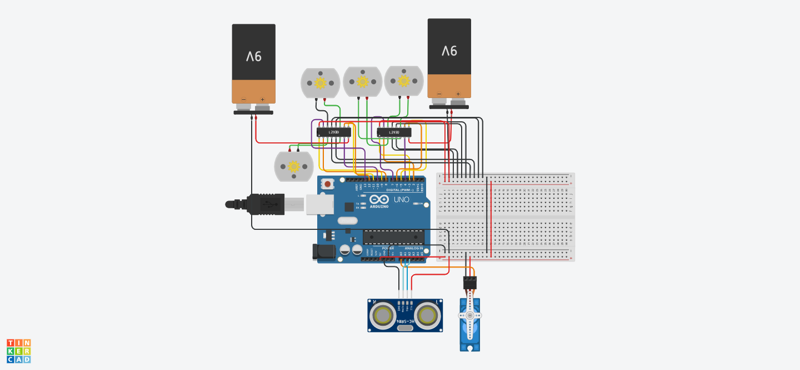

# 🤖 Obstacle-Avoiding Robot with 4 DC Motors, L293D Dual Drivers, Servo and Ultrasonic Sensor

## 📄 Description

This Arduino-based robot is capable of autonomous movement and obstacle avoidance. It utilizes:

- **4 DC motors** controlled via **two L293D H-Bridge ICs**
- **Ultrasonic distance sensor (HC-SR04)** to detect obstacles within 10 cm
- **Servo motor** for directional signaling upon detection
- Fully automated forward, backward, and alternating turning movements

Designed as a beginner project to explore robotics, motor drivers, sensors, and Arduino programming.

---

## 🧠 Features

- Controls 4 DC motors for full mobility
- Detects obstacles with HC-SR04 ultrasonic sensor
- Stops and avoids objects when detected within 10 cm
- Uses servo motor to indicate reaction
- Automated movement routine

---

## 🖥️ Components

| Component               | Quantity |
|------------------------|----------|
| Arduino UNO            | 1        |
| L293D Motor Driver IC  | 2        |
| DC Motors              | 4        |
| Servo Motor (SG90)     | 1        |
| Ultrasonic Sensor      | 1        |
| Breadboard             | 1        |
| Jumper Wires           | As needed |
| 9V Battery (for motors)| 1        |

---

## 📷 project`s circuit

---

## 🔌 Circuit Wiring

### 🟨 L293D Driver #1 (Motors 1 & 2)

| L293D Pin | Arduino Pin | Function            |
|-----------|-------------|---------------------|
| 1 (EN1)   | D3          | Enable Motor 1      |
| 2 (IN1)   | D2          | Motor 1 direction 1 |
| 3 (OUT1)  | → Motor 1 + |
| 4,5       | GND         | Ground              |
| 6 (OUT2)  | → Motor 1 - |
| 7 (IN2)   | D4          | Motor 1 direction 2 |
| 8 (VCC2)  | 9V Battery  | Motor power         |
| 9 (EN2)   | D5          | Enable Motor 2      |
| 10 (IN3)  | D6          | Motor 2 direction 1 |
| 11 (OUT3) | → Motor 2 + |
| 12,13     | GND         | Ground              |
| 14 (OUT4) | → Motor 2 - |
| 15 (IN4)  | D7          | Motor 2 direction 2 |
| 16 (VCC1) | 5V          | Logic power         |

### 🟩 L293D Driver #2 (Motors 3 & 4)

| L293D Pin | Arduino Pin | Function            |
|-----------|-------------|---------------------|
| 1 (EN1)   | D9          | Enable Motor 3      |
| 2 (IN1)   | D8          | Motor 3 direction 1 |
| 3 (OUT1)  | → Motor 3 + |
| 4,5       | GND         | Ground              |
| 6 (OUT2)  | → Motor 3 - |
| 7 (IN2)   | D10         | Motor 3 direction 2 |
| 8 (VCC2)  | 9V Battery  | Motor power         |
| 9 (EN2)   | D11         | Enable Motor 4      |
| 10 (IN3)  | D12         | Motor 4 direction 1 |
| 11 (OUT3) | → Motor 4 + |
| 12,13     | GND         | Ground              |
| 14 (OUT4) | → Motor 4 - |
| 15 (IN4)  | D13         | Motor 4 direction 2 |
| 16 (VCC1) | 5V          | Logic power         |

### 🔵 Servo Motor

| Servo Pin | Arduino Pin |
|-----------|-------------|
| Signal    | A0          |
| VCC       | 5V          |
| GND       | GND         |

### 🔶 Ultrasonic Sensor (HC-SR04)

| Sensor Pin | Arduino Pin |
|------------|-------------|
| Trig       | A1          |
| Echo       | A2          |
| VCC        | 5V          |
| GND        | GND         |

---

## 🤖 Behavior Logic

1. Move forward for 30 seconds
2. Move backward for 1 minute
3. Alternate between turning left and right for 1 minute
4. If an obstacle is detected within 10 cm during movement:
   - Stop all motors
   - Move servo to 90°, then back
   - Move backward for 2 seconds

---

